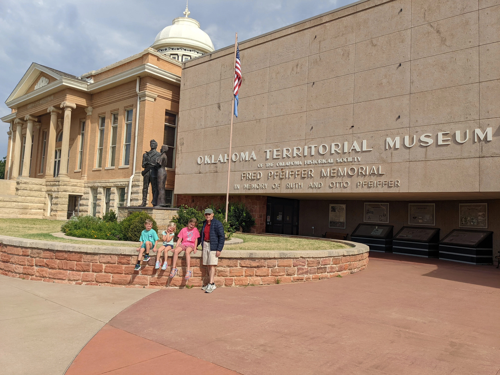

# 24 Hours in Guthrie, Oklahoma

Guthrie feels like you’ve stepped back into the days when Oklahoma was still a frontier territory. The brick-lined streets and Victorian storefronts set the stage, but a day in Guthrie is about more than old buildings. It’s about stories, museums, and a pace that makes you slow down.

## Morning: Oklahoma Territorial Museum

Begin your day at the **Oklahoma Territorial Museum**. The museum explains how Guthrie became the first capital of Oklahoma and brings to life the chaos of the 1889 Land Run. You’ll see period rooms furnished as they were when families first settled here, along with artifacts from early statehood. The building itself stands on the site of the State’s first capitol, so the setting adds weight to the history.

## Midday: Oklahoma Sports Hall of Fame

Next, head to the **Oklahoma Sports Hall of Fame**. The Hall celebrates athletes from across the state, from baseball legends to Olympians. Displays cover more than victories. They show the communities, schools, and families behind the athletes. It makes the visit feel personal rather than just a list of records.

## Afternoon: Oklahoma Frontier Drugstore Museum and Apothecary Garden

In the afternoon, walk over to the **Oklahoma Frontier Drugstore Museum**. The collection includes antique medicine bottles, vintage advertisements, and equipment that looks like it belongs in an old western film. Step outside into the **Apothecary Garden**, where herbs and medicinal plants grow in neat rows. The garden links the artifacts inside to the natural world outside and shows how closely health once tied to plants.

## Dinner: Katie’s Diner

For dinner, grab a booth at **Katie’s Diner**. It’s the kind of place where comfort food rules the menu. Chicken-fried steak, burgers, and mashed potatoes come in portions that don’t leave room for much else. The service is warm, and the diner feels like it belongs in the rhythm of Guthrie itself.

## Evening: Boxcar Ice Cream

End your day with a cone from **Boxcar Ice Cream**. The shop sits in a converted railway car, and the setting matches Guthrie’s mix of history and small-town charm. The flavors change, but whether you go for something classic or adventurous, the stop makes a fitting close to the day.

## Final Note

In twenty-four hours you move from Oklahoma’s first capitol, to its celebrated athletes, to the medicine and gardens that shaped frontier life. Guthrie blends history with small pleasures like a plate of diner food or a scoop of ice cream. The day feels full, yet leaves space to sit on a bench downtown and take in the brick streets that tie it all together.

Would you like me to expand this into a Rick Steves–style guide with practical details like opening hours, ticket costs, and website links for each stop?

## Pratical Info

## Oklahoma Territorial Museum

**Practical info**

* Hours: Tue–Sat, 9 a.m.–5 p.m.
* Cost: Adults \$7, Seniors \$5, Kids \$4 (under 6 free)
* Location: 406 East Oklahoma Ave.
* Website: [okhistory.org](https://www.okhistory.org/sites/territorial)

##  Oklahoma Sports Hall of Fame

**Practical info**

* Hours: Mon–Sat, 10 a.m.–5 p.m.
* Cost: Adults \$5, Kids under 6 free
* Location: 404 West Harrison Ave.
* Website: [oksportshof.org](https://www.oksportshof.org)

## Afternoon: Oklahoma Frontier Drugstore Museum and Apothecary Garden

**Practical info**

* Hours: Fri–Sat, 11 a.m.–3 p.m. (check ahead for seasonal hours)
* Cost: Free (donations welcome)
* Location: 214 West Oklahoma Ave.
* Website: [drugstoremuseum.org](https://www.drugstoremuseum.org)

## Dinner: Katie’s Diner

**Practical info**

* Hours: Mon–Sat, 6 a.m.–2 p.m. (closed Sunday, closes early)
* Location: 120 W Harrison Ave.
* Website: [katiesdiner.com](https://www.katiesdiner.com)

##  Boxcar Ice Cream

**Practical info**

* Hours: Vary by season (usually afternoons and evenings)
* Location: 109 W Harrison Ave.
* Website: [facebook.com/BoxcarIceCream](https://www.facebook.com/BoxcarIceCream)

