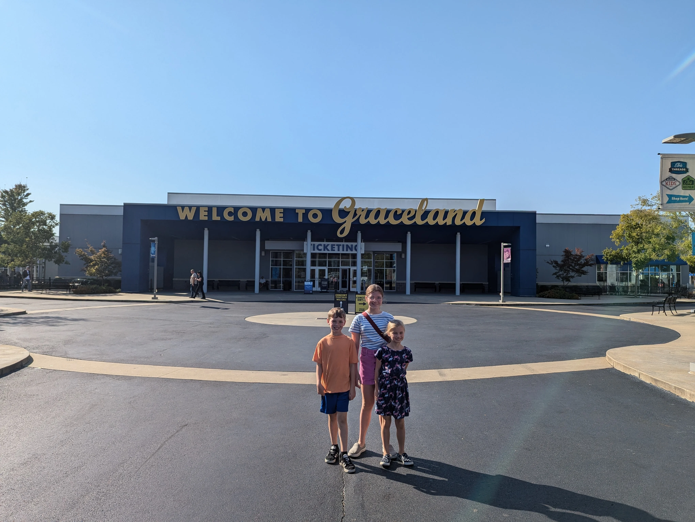

### 48 Hours in Memphis, TN

**Introduction**
Memphis offers history, culture, and tunes. You can live among legends here. We start with Graceland. Then we explore science, river lore, and quiet parks.
















**Graceland**
Elvis Presley’s home is a singular draw. The chapel, the Jungle Room, the car collection—it all feels personal. It anchors Memphis in music history.

**MoSH and the Star Show**
The Pink Palace Museum houses a history and science blend. The AutoZone Dome at the Sharpe Planetarium lets you float in stars while the laser lights pulse above. Science meets theater in a small, round room. That show stays with you. ([MoSH](https://moshmemphis.com/explore/planetarium/)).

The **AutoZone Dome at the Sharpe Planetarium**, part of the Pink Palace Museum & Mansion—operated by the Museums of Science & History (MoSH) in Memphis ([Memphis Museums of Science and History](https://moshmemphis.com/explore/planetarium/)). It projects star fields, visual images, and laser lights on the domed ceiling. The theater seats up to 165 people in a round, immersive setting ([Wikipedia](https://en.wikipedia.org/wiki/Pink_Palace_Museum_and_Planetarium)).

**Riverboat Ride on the Mississippi**
The riverboat ride added stories. Captains shared local lore. The river felt alive with memory. The only flaw: seating was first-come, first-serve. The crowd swelled. Some stood. Others clung to rails. Reserve early. Or arrive right at launch.

**Park Beside the Art Museum**
The park near the art museum offered calm. Trees, a lawn, and a path to pause in. It frames the museum’s architecture and gives a day a quiet moment.

**Memphis Art Museum**
The museum delivers. Good collection. Mixed media. It matches the city’s creative pulse. You leave thinking, That was worth my time.

**Why It Works for Residency**
Music, art, river, science. Memphis holds rich layers. It invites notes in every direction. It makes a writer’s soul stretch. And that river keeps speaking.
